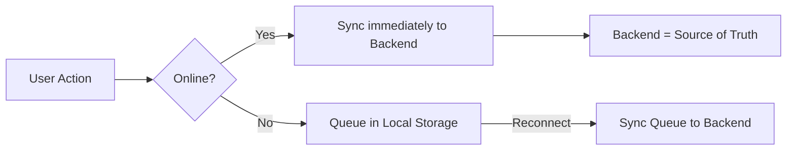
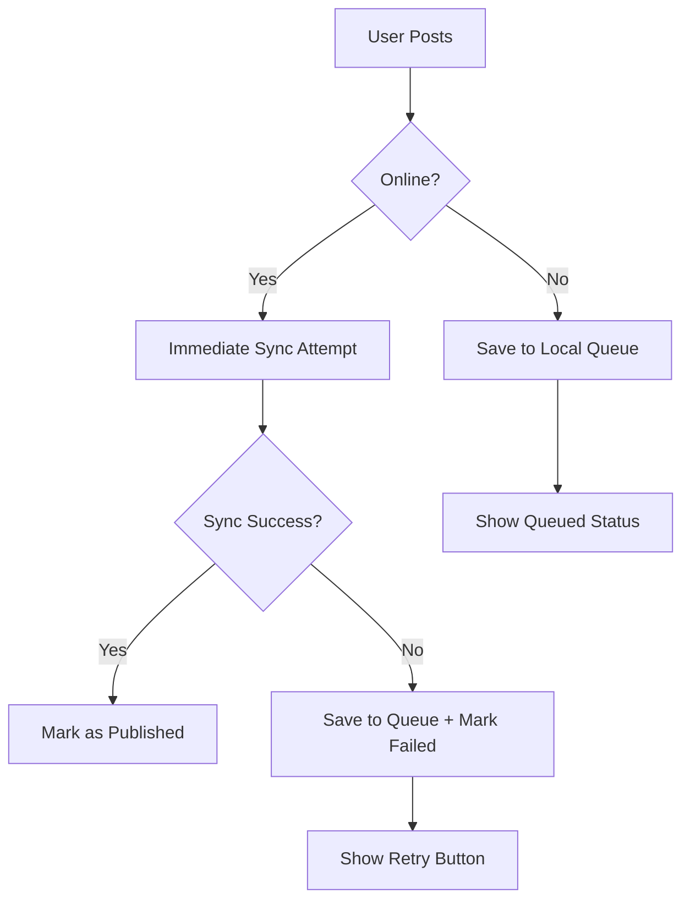

User Experience Priority:
- Users expect to see their posts immediately (even offline)
- But thread data must be consistent across devices → backend as final authority

# MUST work offline:
- Draft post composition ✍️
- Reading cached threads 📖
- Comment drafting 💬

# MUST sync to backend:
- Post publishing 🌐
- Upvote/downvote counts 🔢
- User reputation systems 🏆

