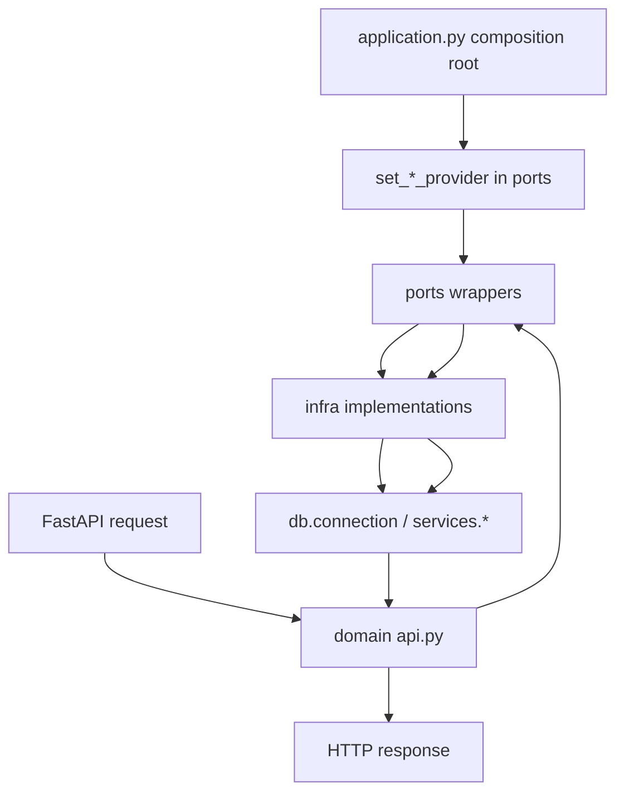

# Step G Domain Architecture Guide

This document is a standalone guide for the current map-backend domain architecture.
It does not replace or modify earlier READMEs.

## 1. Goals

The current architecture aims to:

- keep HTTP/API concerns separate from infrastructure concerns,
- make implementation swaps low-risk (DB, DEM provider, matcher, sync source),
- support incremental service extraction in the future.

## 2. Layer Model

Each domain follows a 3-layer structure:

- `api.py`: HTTP contract layer (FastAPI routing, request/response mapping, HTTP errors).
- `ports.py`: dependency contract layer (protocols + stable indirection wrappers).
- `infra.py`: concrete implementation layer (DB/service integrations).

`application.py` acts as the composition root and binds ports to infra implementations at startup.

## 3. Current Domain Map

- `domains/activities_service/`
  - `api.py`
  - `ports.py`
  - `infra.py`
- `domains/trails_service/`
  - `api.py`
  - `ports.py`
  - `infra.py`
- `domains/elevation_dem_service/`
  - `api.py`
  - `ports.py`
  - `infra.py`
- `domains/sync_worker_service/`
  - `job.py`
  - `ports.py`
  - `infra.py`

## 4. Runtime Wiring Flow

## 5. Why This Improves Extensibility

- API modules are no longer tightly coupled to concrete providers.
- Replacing an implementation usually means updating `infra.py` or composition bindings, not route logic.
- Domain boundaries are explicit and service-oriented, which lowers extraction cost when splitting into microservices.

## 6. Why This Improves Maintainability

- Single responsibility by file role (`api`, `ports`, `infra`).
- Lower blast radius: dependency changes do not require broad route rewrites.
- Easier tests: patch against stable ports-level symbols instead of deep implementation paths.

## 7. Composition Root Rules

`application.py` should be the only place that performs provider binding for runtime.

Recommended rules:

- Keep `set_*_provider(...)` calls centralized in one section.
- Avoid scattered provider binding in domain modules.
- Ensure bindings happen before request handling starts.

## 8. Migration Checklist for New Domain

When adding a new domain (example: `weather_service`):

1. Add `domains/weather_service/api.py` for HTTP endpoints.
2. Add `domains/weather_service/ports.py` for provider contracts and wrappers.
3. Add `domains/weather_service/infra.py` for default implementation.
4. Bind provider(s) in `application.py` composition section.
5. Add focused tests that patch `ports.py` wrappers, not low-level infra calls.

## 9. Testing Strategy (Recommended)

- Route tests patch ports-level wrappers where practical.
- Keep a smoke suite that validates app startup, route registration, and baseline behavior.
- Add contract tests for ports wrappers to ensure each provider binding matches expected signatures.

## 10. Near-Term Next Steps (Optional)

- Add explicit dependency container object (instead of module-level provider state) for stricter lifecycle control.
- Add startup assertion checks that all required providers are bound.
- Add architecture tests to prevent direct `api.py -> services/*` imports.
