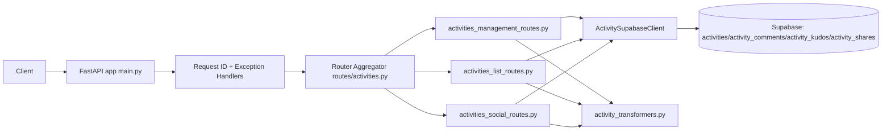

# Activity Backend Folder Technical Documentation

## 1. Folder Overview and Purpose

### Folder Name and Path
- Folder: `activity-backend`
- Repository path: `backend/activity-backend/`

### Business and Technical Purpose
This folder contains the Activity domain service for Syntrak. It owns activity lifecycle APIs and related social interactions for activities.

Core responsibilities:
- Create, read, update, and delete activities
- List activities and user-scoped activity feeds
- Manage activity social interactions (comments, kudos, share links)
- Convert frontend request/response payloads to backend persistence format

Problem solved:
- Isolates Activity domain concerns from other services
- Keeps canonical route ownership for activities in one backend
- Provides a dedicated place for activity-specific validation and transformations

### Ownership
From service ownership policy:
- Domain owner: `activity-backend`
- Canonical base path: `/api/v1/activities`

Reference: `docs/service-ownership.md`

### Dependencies
Internal dependencies:
- `backend/shared/` for shared auth middleware and shared exception/request-id behavior
- `backend/activity-backend/config.py` for environment settings
- `backend/activity-backend/models.py` for request/response schemas

External dependencies:
- FastAPI and Uvicorn
- Supabase Python client and PostgREST count helper
- Pydantic and pydantic-settings

Runtime service dependencies:
- Supabase project (tables/views created by `SUPABASE_SETUP.sql`)

---

## 2. Architecture and Design

### High-Level Design
Request flow:
1. HTTP request enters FastAPI app (`main.py`)
2. Request ID middleware and shared exception handlers are applied
3. Router aggregator (`routes/activities.py`) dispatches to route modules
4. Route modules call `ActivitySupabaseClient` methods in `services/supabase_client.py`
5. Data is read/written via Supabase tables
6. Route transformers map payloads to frontend response models



### Key Design Patterns
- Router Aggregator pattern: keeps domain base path setup in one place and composes focused route modules.
- Service/Repository-like boundary: route layer remains thin; data operations are centralized in `ActivitySupabaseClient`.
- Shared middleware pattern: auth and common error behavior are reused via `backend/shared/`.
- Transformer pattern: payload conversion and metric transformation are isolated in route transformer utilities.

### Data Contracts and Models
Primary API contracts live in `models.py`, including:
- `FrontendActivityCreate`
- `FrontendActivityUpdate`
- `FrontendActivityResponse`
- `DeleteResponse`

Persistence entities (Supabase):
- `activities`
- `activity_comments`
- `activity_kudos`
- `activity_shares`

### External Integrations
- Supabase REST interface for CRUD and list operations
- JWT auth validation through shared auth dependency helpers

---

## 3. Code Structure and Key Components

### File Map
Top-level:
- `main.py`: FastAPI app, middleware, exception handlers, health/root endpoints, lifespan init
- `run.py`: standardized entry-point runner
- `config.py`: typed environment config with defaults
- `models.py`: request/response schemas
- `SUPABASE_SETUP.sql`: schema bootstrap for activity tables and indexes

Routes:
- `routes/activities.py`: router aggregator with `/api/v1/activities` prefix
- `routes/activities_management_routes.py`: create/get-by-id/update/delete endpoints
- `routes/activities_list_routes.py`: list endpoints and filtering/pagination
- `routes/activities_social_routes.py`: comments, kudos, share-link operations
- `routes/activity_transformers.py`: transformation helpers for frontend shape and computed metrics

Middleware and services:
- `middleware/auth.py`: auth dependencies (`get_current_user`, `get_optional_user`) from shared package
- `services/supabase_client.py`: data access and mutation logic

Tests:
- `tests/test_activities_api.py`: API behavior tests
- `tests/conftest.py`: fixtures and test setup

### Entry Points
- Service process entry: `python run.py`
- ASGI app object: `main.py -> app`
- External API entry: routes under `/api/v1/activities`

### Critical Logic
- Activity create flow computes duration and metrics from location points before persistence.
- Visibility is represented as `private/public` (with optional follower-style extension paths).
- Social operations are split into dedicated methods (kudos toggle, comments add/list, share token creation).

Pseudo-flow for create:
1. Validate incoming payload
2. Parse timestamps and compute duration
3. Convert raw locations to normalized points
4. Compute metrics from GPS sequence
5. Persist activity row
6. Transform row into frontend response contract

### Configuration
Defined in `config.py` (env-backed):
- `SUPABASE_URL`
- `SUPABASE_SERVICE_ROLE_KEY`
- `JWT_SECRET`
- `JWT_ALGORITHM`
- `FASTAPI_ENV`
- `HOST`
- `PORT`
- `CORS_ORIGINS`

---

## 4. Development and Maintenance Guidelines

### Setup Instructions
1. Create and activate a virtual environment in `backend/activity-backend/`
2. Install dependencies from `requirements.txt`
3. Create `.env` with required variables
4. Ensure Supabase tables exist (run `SUPABASE_SETUP.sql` in Supabase SQL editor)
5. Start server with `python run.py`

### Testing Strategy
- Test type: API-level tests with fixtures/mocks in `tests/`
- Run from folder:
  - `pytest -q`
- For targeted runs:
  - `pytest tests/test_activities_api.py -q`

Recommended additions:
- Ownership/visibility authorization tests for `GET /{activity_id}`
- Negative tests for auth and malformed payloads
- Contract assertions for transformed frontend response shape

### Code Standards
- Keep route handlers thin (validation/orchestration only)
- Put all data IO in service client methods
- Prefer explicit response models for endpoint contracts
- Keep transformer logic isolated from route logic
- Use structured logger and avoid logging secrets/PII

### Common Pitfalls
- Running `main.py` directly instead of `run.py`
- Forgetting Supabase schema setup
- Missing env vars causing startup/runtime errors
- Route-level auth checks that do not enforce resource-level ownership

### Logging and Monitoring
Current logging:
- Python logging configured in `main.py`
- Startup/shutdown and lifecycle events logged

Recommended monitoring:
- Track request IDs in logs for correlation
- Capture endpoint latency, error rate, and Supabase call failures
- Alert on spikes in 5xx and auth failures

---

## 5. Deployment and Operations

### Build and Deployment Steps
- Docker build uses `backend/activity-backend/Dockerfile`
- CI builds/scans images via `.github/workflows/docker-images.yml`
- Local runtime uses `python run.py`

Important architecture note:
- This service imports from `backend/shared/`; Docker build context must include `backend/` root so `shared/` is available.

### Runtime Requirements
- Python 3.11
- Network access to Supabase URL
- Valid service-role credentials and JWT secret

### Health Checks
- Root endpoint: `GET /`
- Health endpoint: `GET /health`

### Backward Compatibility
- Route contracts should remain stable under `/api/v1/activities`
- Any response shape changes must be documented and versioned
- For breaking changes, include migration notes and frontend coordination

---

## 6. Examples and Usage

### Code Snippets
Create activity:
```bash
curl -X POST "http://127.0.0.1:5100/api/v1/activities/" \
  -H "Authorization: Bearer <JWT>" \
  -H "Content-Type: application/json" \
  -d '{
    "name":"Morning ski",
    "type":"ski",
    "start_time":"2026-03-31T08:00:00Z",
    "end_time":"2026-03-31T09:00:00Z",
    "locations":[]
  }'
```

List activities:
```bash
curl "http://127.0.0.1:5100/api/v1/activities?limit=20&offset=0"
```

### Integration Scenarios
- Frontend Activities feature calls this service for activity CRUD and social interactions.
- Shared auth dependency extracts user identity from JWT and applies it to write operations.
- Transformers map Supabase rows to frontend-friendly contracts.

### CLI Commands
Run app:
```bash
cd backend/activity-backend
python run.py
```

Run tests:
```bash
cd backend/activity-backend
pytest -q
```

---

## 7. Troubleshooting and FAQs

### Common Errors
- `Activity client not initialized`
  - Cause: startup lifecycle not executed before route usage.
  - Fix: run app through `run.py` and confirm startup logs.

- `401 Unauthorized` or auth dependency failure
  - Cause: missing/invalid JWT or JWT secret mismatch.
  - Fix: validate `JWT_SECRET` consistency and bearer token format.

- Supabase operation returns empty or fails unexpectedly
  - Cause: schema mismatch, missing tables, or credential issues.
  - Fix: re-run schema SQL and verify service-role key.

### Debugging Tips
- Enable debug environment via `FASTAPI_ENV=development`
- Correlate logs with request IDs
- Reproduce endpoint behavior via curl before frontend debugging

### Performance Tuning
- Use indexed query paths (user_id, visibility, created_at)
- Keep list endpoints paginated (`limit`, `offset`)
- Avoid returning oversized GPS payloads unless necessary
- Consider denormalized stats view reads for list responses when load grows

---

## Document Maintenance
- Update this file whenever endpoint contracts, auth rules, or data model behavior changes.
- Keep file map and setup instructions synchronized with actual folder structure.
- Owner for updates: maintainers of `backend/activity-backend/`.
